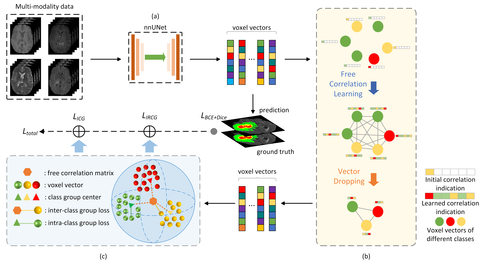

<h1>HMGC</h1>

This is a brief code structure of HMGC for studying only. You may integrate the components of HMGC into nnUNetv2 or your own model to fully utilize this method

You can find all components of HMGC in ./models, including FCL, Group Loss and a fixed unet3d derived from nnUNetv2.
